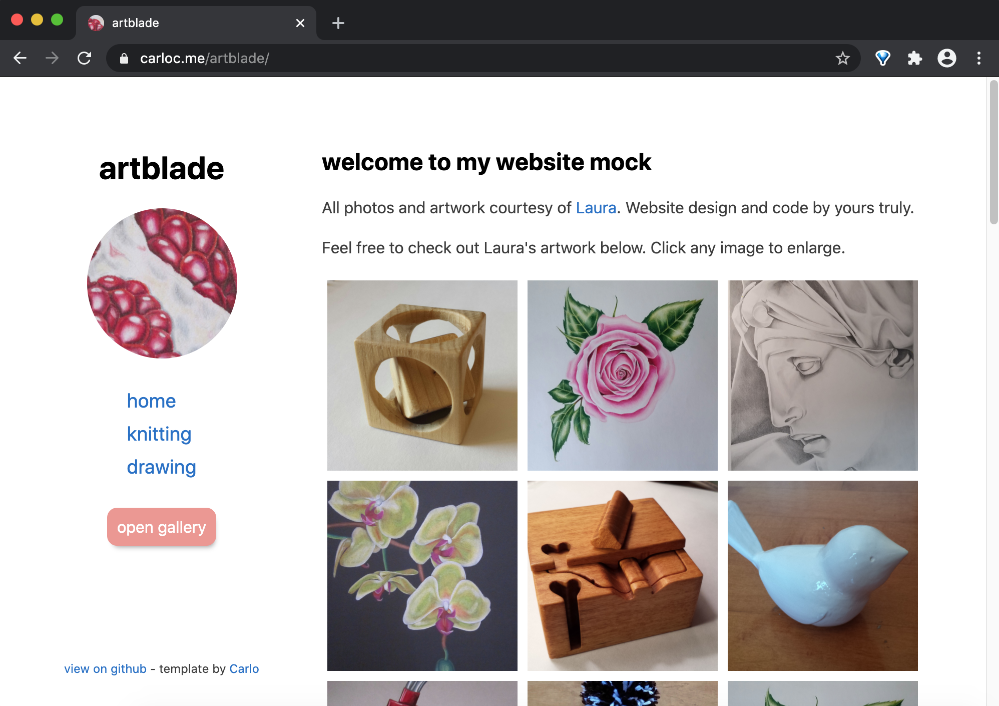
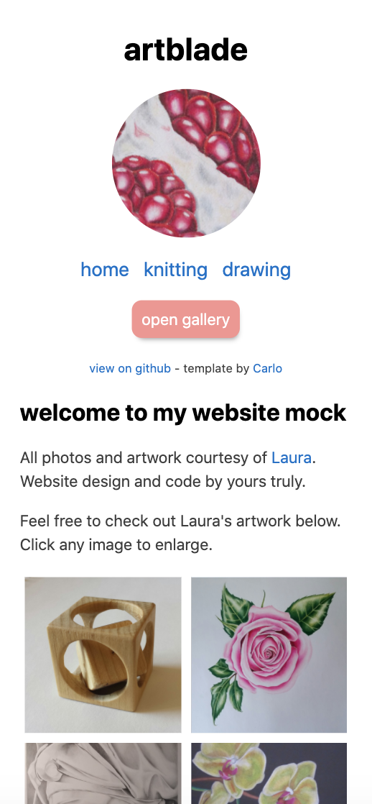
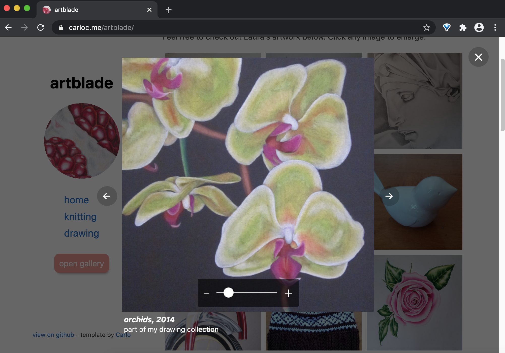

## carloc.me/artblade

A simple, clean website template I built using plain HTML, CSS, and JS.

- Fixed left header design
    - Layout responds to varying screen sizes and mobile devices
- Responsive grid of images and navigation cards
- Image modal for perusing a photo gallery
- All interactive elements are accessible via keyboard controls

